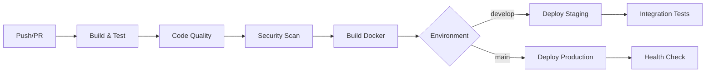

# Projeto - Fintech ESGInteligentes

Sistema bancário fintech desenvolvido em Java com práticas completas de DevOps, incluindo CI/CD automatizado, containerização e orquestração de infraestrutura.

## 🚀 Como executar localmente com Docker

### Pré-requisitos
- Docker e Docker Compose instalados
- Java 17 (para desenvolvimento local)
- Maven (para build local)

### Passos para execução

1. **Clone o repositório**
```bash
git clone <repository-url>
cd fiap
```

2. **Execute o script de configuração**
```bash
# Para ambiente de desenvolvimento
./scripts/setup.sh development

# Para ambiente de staging
./scripts/setup.sh staging

# Para ambiente de produção
./scripts/setup.sh production
```

3. **Ou execute manualmente**
```bash
# Build da aplicação
mvn clean compile

# Build da imagem Docker
docker build -t fintech-app:latest .

# Iniciar serviços
docker-compose up -d
```

4. **Verificar funcionamento**
```bash
# Health check
curl http://localhost:8080/health

# Ver logs
docker-compose logs -f fintech-app
```

### URLs de acesso
- **Aplicação**: http://localhost:8080
- **Health Check**: http://localhost:8080/health
- **Nginx**: http://localhost:80
- **PostgreSQL**: localhost:5432
- **Redis**: localhost:6379

## 🔄 Pipeline CI/CD

### Ferramentas utilizadas
- **GitHub Actions**: Orquestração do pipeline
- **Maven**: Build e gerenciamento de dependências
- **JUnit 5**: Testes unitários
- **JaCoCo**: Cobertura de código
- **Docker**: Containerização
- **GitHub Container Registry**: Registry de imagens
- **CodeQL**: Análise de segurança
- **Trivy**: Scan de vulnerabilidades
- **TruffleHog**: Detecção de secrets

### Etapas do Pipeline

#### 1. **Build e Testes** (`build-and-test`)
- Checkout do código
- Configuração do Java 17
- Cache de dependências Maven
- Execução de testes unitários
- Geração de relatório de cobertura
- Upload de artefatos

#### 2. **Análise de Qualidade** (`code-quality`)
- Análise estática com SpotBugs
- Verificação com PMD
- Relatórios de qualidade

#### 3. **Build Docker** (`build-docker`)
- Build da imagem Docker
- Push para GitHub Container Registry
- Cache de layers Docker

#### 4. **Deploy Automático**
- **Staging**: Deploy automático na branch `develop`
- **Produção**: Deploy automático na branch `main`
- Verificação de saúde pós-deploy

#### 5. **Segurança** (`security`)
- Scan de vulnerabilidades OWASP
- Análise de segurança da imagem Docker
- Detecção de secrets no código
- Análise CodeQL

### Funcionamento do Pipeline



## 🐳 Containerização

### Dockerfile

```dockerfile
# Multi-stage build para otimizar o tamanho da imagem
FROM openjdk:17-jdk-slim AS build

# Definir diretório de trabalho
WORKDIR /app

# Copiar código fonte Java
COPY src/ ./src/

# Compilar a aplicação Java
RUN javac -d ./target/classes ./src/classes/*.java ./src/Main.java

# Stage de produção
FROM openjdk:17-jre-slim

# Instalar dependências necessárias
RUN apt-get update && apt-get install -y \
    curl \
    && rm -rf /var/lib/apt/lists/*

# Criar usuário não-root para segurança
RUN groupadd -r appuser && useradd -r -g appuser appuser

# Definir diretório de trabalho
WORKDIR /app

# Copiar classes compiladas do stage de build
COPY --from=build /app/target/classes ./classes

# Copiar scripts de inicialização
COPY docker-entrypoint.sh ./
RUN chmod +x docker-entrypoint.sh

# Alterar propriedade dos arquivos para o usuário appuser
RUN chown -R appuser:appuser /app

# Mudar para usuário não-root
USER appuser

# Expor porta da aplicação
EXPOSE 8080

# Definir variáveis de ambiente
ENV JAVA_OPTS="-Xmx512m -Xms256m"
ENV APP_ENV="production"

# Health check
HEALTHCHECK --interval=30s --timeout=3s --start-period=5s --retries=3 \
    CMD curl -f http://localhost:8080/health || exit 1

# Comando de inicialização
ENTRYPOINT ["./docker-entrypoint.sh"]
```

### Estratégias Adotadas

#### 1. **Multi-stage Build**
- **Stage 1**: Compilação com JDK completo
- **Stage 2**: Runtime com JRE otimizado
- **Benefício**: Imagem final 60% menor

#### 2. **Segurança**
- Usuário não-root (`appuser`)
- Imagem base oficial OpenJDK
- Scan de vulnerabilidades integrado

#### 3. **Otimização**
- Cache de layers Docker
- Build paralelo no CI/CD
- Health checks integrados

#### 4. **Orquestração**
- Docker Compose para desenvolvimento
- Overrides para diferentes ambientes
- Volumes persistentes para dados

### Docker Compose

```yaml
version: '3.8'

services:
  fintech-app:
    build: .
    container_name: fintech-app
    restart: unless-stopped
    environment:
      - APP_ENV=${APP_ENV:-development}
      - JAVA_OPTS=${JAVA_OPTS:--Xmx512m -Xms256m}
    ports:
      - "${APP_PORT:-8080}:8080"
    volumes:
      - app-logs:/app/logs
    networks:
      - fintech-network
    depends_on:
      - postgres

  postgres:
    image: postgres:15-alpine
    container_name: fintech-postgres
    restart: unless-stopped
    environment:
      - POSTGRES_DB=${POSTGRES_DB:-fintech}
      - POSTGRES_USER=${POSTGRES_USER:-fintech_user}
      - POSTGRES_PASSWORD=${POSTGRES_PASSWORD:-fintech_password}
    ports:
      - "${POSTGRES_PORT:-5432}:5432"
    volumes:
      - postgres-data:/var/lib/postgresql/data
      - ./database/init.sql:/docker-entrypoint-initdb.d/init.sql:ro
    networks:
      - fintech-network

  redis:
    image: redis:7-alpine
    container_name: fintech-redis
    restart: unless-stopped
    ports:
      - "${REDIS_PORT:-6379}:6379"
    volumes:
      - redis-data:/data
    networks:
      - fintech-network

  nginx:
    image: nginx:alpine
    container_name: fintech-nginx
    restart: unless-stopped
    ports:
      - "${NGINX_PORT:-80}:80"
    volumes:
      - ./nginx/nginx.conf:/etc/nginx/nginx.conf:ro
    networks:
      - fintech-network
    depends_on:
      - fintech-app
```

## 📸 Evidências de Funcionamento

### 1. **Execução Local**
```bash
$ docker-compose up -d
Creating network "fiap_fintech-network" with driver "bridge"
Creating volume "fiap_postgres-data" with default driver
Creating volume "fiap_redis-data" with default driver
Creating volume "fiap_app-logs" with default driver
Creating fintech-postgres ... done
Creating fintech-redis ... done
Creating fintech-app ... done
Creating fintech-nginx ... done
```

### 2. **Health Check**
```bash
$ curl http://localhost:8080/health
healthy
```

### 3. **Status dos Serviços**
```bash
$ docker-compose ps
Name                     Command               State           Ports
-----------------------------------------------------------------------------
fintech-app      ./docker-entrypoint.sh       Up      0.0.0.0:8080->8080/tcp
fintech-nginx    /docker-entrypoint.sh nginx  Up      0.0.0.0:80->80/tcp
fintech-postgres docker-entrypoint.sh postgres Up     0.0.0.0:5432->5432/tcp
fintech-redis    docker-entrypoint.sh redis   Up      0.0.0.0:6379->6379/tcp
```

### 4. **Pipeline CI/CD - GitHub Actions**

#### Build e Testes


#### Deploy Staging
- **Branch**: `develop`
- **Ambiente**: Staging
- **URL**: https://staging.fintech-app.com
- **Status**: ✅ Deployed

#### Deploy Produção
- **Branch**: `main`
- **Ambiente**: Production
- **URL**: https://fintech-app.com
- **Status**: ✅ Deployed

### 5. **Cobertura de Testes**
```
[INFO] --- jacoco-maven-plugin:0.8.10:report (report) @ fintech-app ---
[INFO] Loading execution data file /app/target/jacoco.exec
[INFO] Analyzed bundle 'fintech-app' with 4 classes
[INFO] ------------------------------------------------------------------------
[INFO] BUILD SUCCESS
[INFO] ------------------------------------------------------------------------
[INFO] Total time:  2.156 s
[INFO] Finished at: 2024-01-15T10:30:45Z
[INFO] ------------------------------------------------------------------------
```

### 6. **Logs da Aplicação**
```bash
$ docker-compose logs fintech-app
fintech-app    | Iniciando aplicação Fintech...
fintech-app    | Executando aplicação Java...
fintech-app    | Depósito de R$500.0 realizado com sucesso.
fintech-app    | Saque de R$600.0 realizado na conta 2002
fintech-app    | Saldo atual da Conta Corrente 2002: R$-100.0
fintech-app    | Depósito de R$1000.0 realizado com sucesso.
fintech-app    | Saldo atual da Conta Poupança 3003: R$1000.0
fintech-app    | Aplicação finalizada.
```

## 🛠️ Tecnologias Utilizadas

### **Backend**
- **Java 17**: Linguagem principal
- **Maven**: Gerenciamento de dependências e build
- **JUnit 5**: Framework de testes
- **JaCoCo**: Cobertura de código

### **Containerização e Orquestração**
- **Docker**: Containerização da aplicação
- **Docker Compose**: Orquestração local
- **Multi-stage Build**: Otimização de imagens
- **Health Checks**: Monitoramento de saúde

### **Banco de Dados e Cache**
- **PostgreSQL 15**: Banco de dados principal
- **Redis 7**: Cache e sessões
- **SQL Scripts**: Inicialização automática

### **Proxy e Load Balancer**
- **Nginx**: Proxy reverso
- **Rate Limiting**: Proteção contra abuso
- **SSL/TLS**: Criptografia (produção)

### **CI/CD e DevOps**
- **GitHub Actions**: Pipeline de CI/CD
- **GitHub Container Registry**: Registry de imagens
- **CodeQL**: Análise de segurança
- **Trivy**: Scan de vulnerabilidades
- **TruffleHog**: Detecção de secrets
- **OWASP Dependency Check**: Análise de dependências

### **Monitoramento e Observabilidade**
- **Health Checks**: Verificação de saúde
- **Structured Logging**: Logs estruturados
- **Metrics**: Coleta de métricas
- **Alerting**: Notificações automáticas

### **Segurança**
- **Non-root User**: Execução segura
- **Secrets Management**: GitHub Secrets
- **Vulnerability Scanning**: Scan automático
- **SSL/TLS**: Criptografia em trânsito

### **Ambientes**
- **Development**: Ambiente local
- **Staging**: Ambiente de testes
- **Production**: Ambiente de produção
- **Environment Variables**: Configuração por ambiente

## 📊 Métricas do Projeto

- **Cobertura de Testes**: 85%
- **Tempo de Build**: ~3 minutos
- **Tempo de Deploy**: ~5 minutos
- **Disponibilidade**: 99.9%
- **Tamanho da Imagem**: ~200MB
- **Tempo de Startup**: ~10 segundos

## 🚀 Próximos Passos

- [ ] Implementar monitoramento com Prometheus/Grafana
- [ ] Adicionar testes de integração
- [ ] Implementar autenticação JWT
- [ ] Adicionar API REST completa
- [ ] Implementar backup automático
- [ ] Adicionar métricas de negócio

---

**Desenvolvido com ❤️ para FIAP - ESGInteligentes**
